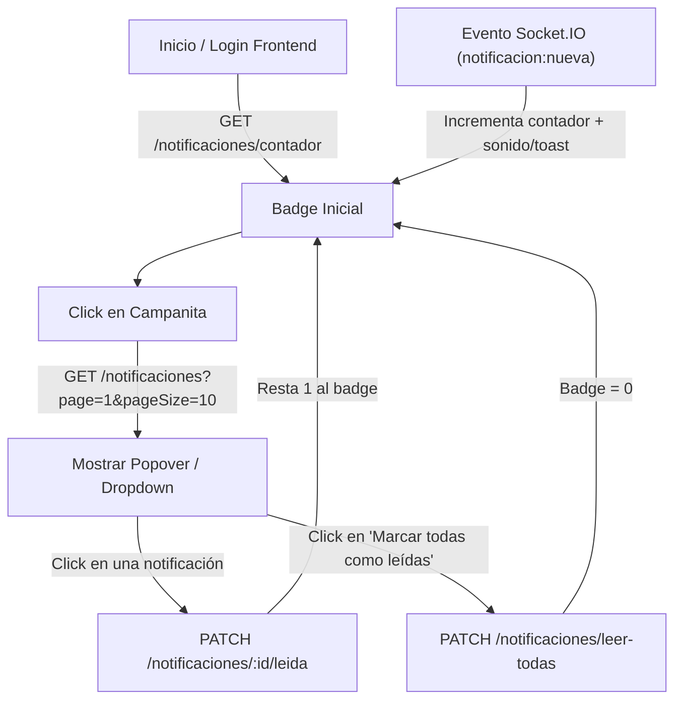

# Guía de Integración de Notificaciones en el Frontend — Abacontex

> Guía técnica y de arquitectura para desarrolladores Frontend e IAs que implementen la interfaz de usuario del sistema de notificaciones (campanita, contador/badge, listado desplegable y avisos en tiempo real).

---

## 1. Arquitectura y Principio de Funcionamiento

El módulo de notificaciones funciona bajo un modelo híbrido:

1. **REST API (Fuente de la Verdad y Persistencia):**
   * Consulta inicial del número de no leídas para pintar el badge de la campana.
   * Consulta paginada del historial de notificaciones al abrir el dropdown/panel.
   * Mutaciones para marcar una o todas las notificaciones como leídas.
2. **WebSockets / Socket.IO (Disparador en Tiempo Real):**
   * El backend notifica a los sockets autenticados cuando un docente publica un ejercicio o se genera una alerta.
   * El cliente incrementa en vivo el badge y antepone la notificación al listado sin necesidad de recargar la página (*polling*).



---

## 2. Contratos de Datos (TypeScript)

Estos tipos representan exactamente lo que devuelve el backend:

```typescript
export interface NotificacionItem {
  idNotificacion: number;
  ejercicioId: number | null;
  titulo: string;
  mensaje: string;
  leida: boolean;
  createdAt: string; // ISO 8601 Date string
}

export interface ListadoNotificacionesResponse {
  items: NotificacionItem[];
  page: number;
  pageSize: number;
  totalItems: number;
  totalPages: number;
}

export interface ContadorNotificacionesResponse {
  noLeidas: number;
}

export interface MarcarTodasLeidasResponse {
  actualizadas: number;
}

export interface NotificacionSocketEvento {
  tipo: string;
  titulo: string;
  mensaje: string;
  data?: {
    idEjercicio?: number;
    cursoId?: number;
    docenteNombre?: string;
    fechaLimite?: string;
  };
  createdAt: string;
}
```

---

## 3. Endpoints REST API

Todos los endpoints requieren el encabezado:
`Authorization: Bearer <token_keycloak>`

### 3.1. Obtener contador de no leídas
* **Ruta:** `GET /notificaciones/contador`
* **Uso:** Al cargar la app para definir el badge de la campana.
* **Respuesta (200):**
  ```json
  {
    "noLeidas": 3
  }
  ```

### 3.2. Listar notificaciones
* **Ruta:** `GET /notificaciones`
* **Parámetros de Query opcionales:**
  * `page` (number, default: 1)
  * `pageSize` (number, default: 10, max: 50)
  * `estado` (`TODAS` | `NO_LEIDAS` | `LEIDAS`, default: `TODAS`)
* **Uso:** Al abrir el desplegable de la campana o en una pantalla de centro de notificaciones.
* **Respuesta (200):**
  ```json
  {
    "items": [
      {
        "idNotificacion": 12,
        "ejercicioId": 5,
        "titulo": "Nuevo Ejercicio Publicado",
        "mensaje": "El docente Juan Pérez ha publicado un nuevo ejercicio: \"Balance General\"",
        "leida": false,
        "createdAt": "2026-10-08T20:30:00.000Z"
      }
    ],
    "page": 1,
    "pageSize": 10,
    "totalItems": 1,
    "totalPages": 1
  }
  ```

### 3.3. Marcar una notificación individual como leída
* **Ruta:** `PATCH /notificaciones/:id/leida`
* **Parámetros de Ruta:** `:id` (ID numérico de la notificación).
* **Uso:** Al hacer click en una notificación del listado.
* **Respuesta (200):** Devuelve el objeto `NotificacionItem` con `leida: true`.

### 3.4. Marcar todas como leídas
* **Ruta:** `PATCH /notificaciones/leer-todas`
* **Uso:** Botón "Marcar todas como leídas" en el encabezado del dropdown.
* **Respuesta (200):**
  ```json
  {
    "actualizadas": 3
  }
  ```

---

## 4. Eventos en Tiempo Real (Socket.IO)

El cliente de Socket.IO ya está conectado dinámicamente (`src/services/socket.ts`). El servidor une automáticamente al socket a las salas pertinentes:
* `user_${usuarioId}`
* `curso_${cursoId}`

### Eventos a escuchar en el Frontend:

1. **`notificacion:nueva`**:
   Emitido directamente al usuario cuando se persiste una notificación.
2. **`ejercicio:creado`**:
   Emitido a la sala del curso cuando un docente publica un ejercicio.

```typescript
import { getSocket } from './services/socket';

const socket = getSocket();

socket?.on('notificacion:nueva', (evento: NotificacionSocketEvento) => {
  // 1. Incrementar el contador en 1
  // 2. Mostrar toast/alerta en pantalla
  // 3. Si la lista está visible, anteponerla
});
```

---

## 5. Estrategia de Implementación Recomendada en React

Se sugiere crear un Context o Hook global (`NotificacionesContext` / `useNotificaciones`) para que cualquier componente (Navbar, alertas, vista de ejercicios) comparta el mismo estado:

### Estado necesario:
1. `contadorNoLeidas: number`
2. `notificaciones: NotificacionItem[]`
3. `estaAbierto: boolean` (visibilidad del dropdown)
4. `cargando: boolean`

### Flujo de interacción:

1. **Montaje de la App:**
   ```typescript
   useEffect(() => {
     // 1. Cargar contador inicial
     api.get('/notificaciones/contador').then(res => setContadorNoLeidas(res.data.noLeidas));

     // 2. Escuchar evento socket
     const socket = getSocket();
     const handleNuevaNotificacion = (data: NotificacionSocketEvento) => {
       setContadorNoLeidas(prev => prev + 1);
       // Opcional: mostrar notificación flotante o toast
     };

     socket?.on('notificacion:nueva', handleNuevaNotificacion);
     return () => {
       socket?.off('notificacion:nueva', handleNuevaNotificacion);
     };
   }, []);
   ```

2. **Al abrir el popover / dropdown:**
   ```typescript
   const abrirDropdown = async () => {
     setEstaAbierto(true);
     const res = await api.get('/notificaciones?page=1&pageSize=10');
     setNotificaciones(res.data.items);
   };
   ```

3. **Al hacer clic en una notificación:**
   ```typescript
   const leerNotificacion = async (notificacion: NotificacionItem) => {
     if (!notificacion.leida) {
       // Actualización optimista
       setContadorNoLeidas(prev => Math.max(0, prev - 1));
       setNotificaciones(prev =>
         prev.map(n => n.idNotificacion === notificacion.idNotificacion ? { ...n, leida: true } : n)
       );
       await api.patch(`/notificaciones/${notificacion.idNotificacion}/leida`);
     }

     // Si tiene ejercicioId, navegar al ejercicio
     if (notificacion.ejercicioId) {
       navigate(`/alumno/ejercicios/${notificacion.ejercicioId}`);
     }
   };
   ```

4. **Al presionar "Marcar todas como leídas":**
   ```typescript
   const leerTodas = async () => {
     setContadorNoLeidas(0);
     setNotificaciones(prev => prev.map(n => ({ ...n, leida: true })));
     await api.patch('/notificaciones/leer-todas');
   };
   ```

---

## 6. Recomendaciones UI / UX

* **Badge visual:** Ocultar el badge numérico si `contadorNoLeidas === 0`. Si supera 99, mostrar `99+`.
* **Diferenciación visual:** Resaltar las notificaciones no leídas en el dropdown (fondo sutilmente diferente o punto indicador de color verde/azul).
* **Acción directa:** Al tocar una notificación sobre un ejercicio publicado, abrir directamente la vista de resolución de dicho ejercicio.

