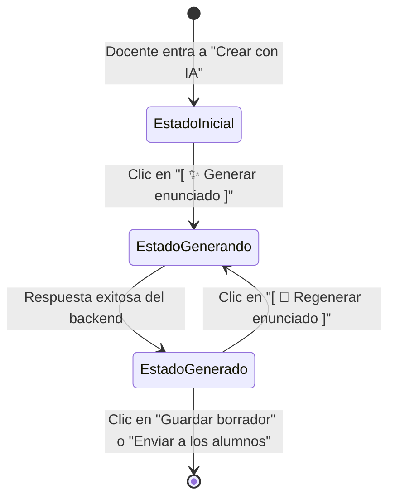
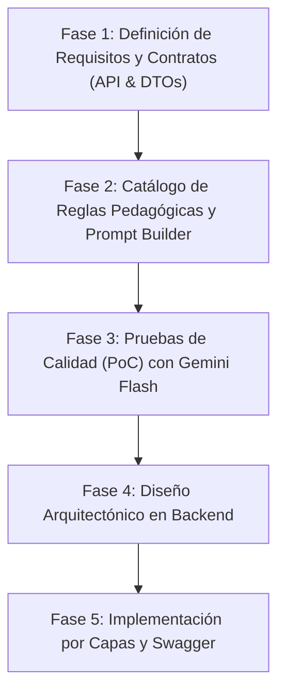

# Roadmap y Análisis: Módulo de IA y Generación de Enunciados Contables

Este documento complementa a [Decisiones Ejercicios y correcciones.md](./Decisiones%20Ejercicios%20y%20correcciones.md) y define la estrategia para el diseño, calibración pedagógica e implementación técnica del submódulo de **Generación de Enunciados Asistida por IA** en Abacontex.

---

## 1. Contexto y Filosofía de Diseño

El sistema Abacontex aborda la generación de consignas contables bajo las siguientes premisas fundamentales:

- **Prompt Dinámico Basado en Reglas Estructuradas:** Se evita expresamente depender de instrucciones libres o prompts largos escritos enteramente por el docente. La consigna se compone a partir de una matriz pedagógica predefinida y controlada por el backend.
- **Control y Validación Docente:** La IA actúa como un redactor acelerador y variador de casos, nunca como decisor final. El resultado siempre se entrega en una tarjeta de **Vista previa editable** antes de que el ejercicio sea guardado o asignado a los alumnos.
- **Consumo Eficiente de Tokens:** En lugar de enviar un esquema monolithic o ejemplos completos de enunciados en cada petición, el backend actúa como un **ensamblador selectivo** que compila únicamente las directivas que aplican a la combinación solicitada.

---

## 2. Parámetros del Generador y Reglas Pedagógicas

De acuerdo con el documento de decisiones y el diseño de la interfaz docente, los parámetros de entrada se agrupan en:

### 2.1. Curso (`cursoId`)

Determina el encuadre institucional y societario de la empresa ficticia:

- **5.° Año:** Se orienta preferentemente a Sociedades de Responsabilidad Limitada (**S.R.L.**) y contenidos contables iniciales/intermedios.
- **6.° Año:** Se orienta preferentemente a Sociedades Anónimas (**S.A.**) e incorpora temáticas complejas (costos fabriles, ajustes avanzados).

### 2.2. Tipo de Ejercicio (`tipoEjercicio`)

Se definen cuatro tipos principales:

1. **Compras y ventas básicas (`COMPRAS_VENTAS_BASICAS`):** Primeras actividades de registración. Operaciones identificadas mediante comprobantes comerciales (Factura Original, Factura Duplicado, Recibo).
2. **Operaciones comerciales integradas (`OPERACIONES_COMERCIALES_INTEGRADAS`):** Secuencia cronológica completa combinando compras, ventas, cobros, pagos, bancos, cheques diferidos, pagarés, cuentas corrientes e intereses.
3. **Ajustes y Hoja de Trabajo (`AJUSTES_HOJA_TRABAJO`):** El enunciado parte de una estructura tabular de datos contables previos (Balance inicial de sumas y saldos) y solicita registrar operaciones de ajuste (arqueo de caja, amortizaciones de bienes de uso, diferencias de inventario, depuración de deudores).
4. **Costos y proceso productivo (`COSTOS_PROCESO_PRODUCTIVO`):** Casos integrales de empresas industriales que contemplan materia prima, mano de obra directa, gastos indirectos de fabricación (GIF), prorrateos, determinación del costo unitario y venta de productos terminados.

### 2.3. Contenidos Adicionales (`contenidosAdicionales`)

Aparecen condicionalmente cuando se selecciona `COMPRAS_VENTAS_BASICAS`:

- **Incluir IVA:** Incorpora alícuotas del 21% y liquidación/posición mensual.
- **Incluir intereses:** Incorpora recargos por financiación o pagos a plazo.
- **Incluir descuentos:** Incorpora bonificaciones y quitas por pago al contado.
  _(Opcionales, selección múltiple de 0 a todos)._

### 2.4. Dificultad (`dificultad`)

Modula tanto el volumen de consignas como la interdependencia entre operaciones:

- **Básico:** ~4 operaciones o consignas directas con baja dependencia entre sí.
- **Intermedio:** ~6 operaciones con vinculación moderada (ej. cobro de una venta anterior).
- **Avanzado:** ~10 operaciones con cancelaciones parciales, cálculos auxiliares e integración conceptual profunda.

### 2.5. Contexto Adicional Opcional (`contextoAdicional`)

Texto libre acotado a un **máximo estricto de 200 caracteres** (con contador visual). Permite especificar particularidades contextuales sin alterar las reglas contables duras (ej: _"Empresa del rubro gastronómico"_ o _"Uso exclusivo de transferencias bancarias"_).

---

## 3. Interacción en la Interfaz (UX) y Ciclo de Vida

A partir del análisis de la pantalla **Nuevo ejercicio — Crear con IA** ([`media_1790084603569.png`](file:///home/braian/.gemini/antigravity/brain/e8d29a94-0fe9-444d-b24b-0f8b8507c3f6/.user_uploaded/media_1790084603569.png)), se establecen los siguientes estados de interacción:



### 3.1. Disparador Explícito: Botón Generar / Regenerar

Para evitar consumos desmedidos de API provocados por cambios automáticos (`onChange`) o tipeo en el contexto libre:

- Se incorpora al final de la tarjeta de parámetros el botón:
  - **`[ ✨ Generar enunciado ]`** (deshabilitado hasta que `Curso`, `Tipo de ejercicio` y `Dificultad` tengan valor).
  - Una vez que ya existe un enunciado en vista previa, muta a **`[ 🔄 Regenerar enunciado ]`** para permitir nuevas variantes con los mismos parámetros.

### 3.2. Estados de la Tarjeta "Vista previa del ejercicio"

1. **Estado Inicial (Vacío):** Muestra un placeholder o empty state invitando a configurar los parámetros y presionar el botón de generación. Los botones de guardado final permanecen deshabilitados.
2. **Estado de Carga (Loading):** Spinner en el botón y efecto de esqueleto (_skeleton loader_) en la tarjeta de vista previa.
3. **Estado Generado:** Renderizado del texto Markdown con el botón del lápiz ($\✎$) habilitado para ajustes manuales. Se habilitan los botones _Guardar borrador_ y _Enviar a los alumnos_.

### 3.3. Desacoplamiento entre Generación y Creación

Existe una frontera clara de responsabilidades:

- **`POST /ejercicios/generar` (Stateless / Asistencial):** Solo recibe los parámetros del enunciado (`cursoId`, `tipoEjercicio`, `dificultad`, etc.) y devuelve `{ enunciadoTexto: string }`.
- **`POST /ejercicios` (Persistencia / Entidad):** Se ejecuta únicamente al presionar _Guardar borrador_ o _Enviar a los alumnos_, consolidando el `enunciadoTexto` final (con las ediciones docentes si las hubo), `fechaLimite`, `plantillas` y `resolucionDocente`.

---

## 4. Formato de Salida y Contrato de Datos

### Formato de Presentación: Markdown Semántico (GFM)

El texto generado respetará estrictamente las mismas convenciones acordadas en la digitalización OCR:

- **Estructura jerárquica:** Encabezado institucional con nombre de la empresa y tipo societario (`### Distribuidora Norte S.R.L.`).
- **Cronología e incisos:** Cada consigna separada por **doble salto de línea (`\n\n`)** para evitar colapsos visuales.
- **Comprobantes y fechas:** Resaltados en negrita (`**02/05 - Factura Original N.° 0001-00004523**`).
- **Símbolos monetarios argentinos:** Signo pesos natural con espacio y puntuación estándar (`$ 150.000,00`).
- **Tablas contables:** Tablas con sintaxis Markdown (`|`) y alineación a la derecha para importes numéricos.

### Estructura de Datos (DTOs Conceptuales)

#### Request: `GenerarEjercicioDTO`

```json
{
  "cursoId": 1,
  "tipoEjercicio": "COMPRAS_VENTAS_BASICAS",
  "dificultad": "INTERMEDIO",
  "contenidosAdicionales": ["IVA", "INTERESES"],
  "contextoAdicional": "Empresa dedicada a la venta de artículos de librería."
}
```

#### Response: `GenerarEjercicioResponseDTO`

```json
{
  "enunciadoTexto": "### Librería Sarmiento S.R.L. - Responsable Inscripto\n\n1. **02/05 - Factura Original N° 0001-00002130** por compra de artículos escolares por $ 150.000,00 abonando en cuenta corriente comercial con un recargo por intereses del 5%..."
}
```

---

## 5. Estrategia de Prompt Dinámico y Optimización de Tokens

Para garantizar costo mínimo y determinismo:

```text
┌────────────────────────────────────────────────────────┐
│                   Backend Assembly                     │
├────────────────────────────────────────────────────────┤
│ 1. Instrucción Maestra del Sistema (Reglas contables)  │
│ 2. Regla según Curso (5.° SRL vs 6.° SA)               │
│ 3. Regla según Tipo de Ejercicio seleccionado          │
│ 4. Regla según Dificultad (consignas, dependencias)    │
│ 5. Contenidos Adicionales activos                      │
│ 6. Contexto Opcional del Docente (si existe)           │
└─────────────────────────┬──────────────────────────────┘
                          │
                          ▼
            Prompt Compilado a Gemini Flash
```

- **Modelo Principal:** `gemini-2.5-flash` con fallback automático a `gemini-2.0-flash`.
- **Temperatura baja (`0.2` - `0.3`):** Suficiente creatividad para variar nombres, fechas y números realistas, pero estricta adherencia a las normas contables y la estructura pedida.
- **Costo estimado por generación:** Menos de $0,0005 USD por enunciado completo.

---

## 6. Hoja de Ruta (Roadmap de Implementación)



### Fase 1: Definición de Requisitos y Contratos (API & DTOs)

- [x] Definir enums del dominio: `TipoEjercicio`, `DificultadEjercicio`, `ContenidoAdicional` ([`src/constants/ejercicio.constants.ts`](../../backend/src/constants/ejercicio.constants.ts)).
- [x] Crear el DTO de entrada y validador Zod (`generarEjercicioSchema`) en [`src/validators/ejercicio.validator.ts`](../../backend/src/validators/ejercicio.validator.ts).
- [x] Crear el DTO de respuesta `GenerarEjercicioResponseDTO` en [`src/dto/ejercicio/ejercicio.dto.ts`](../../backend/src/dto/ejercicio/ejercicio.dto.ts).
- [x] Especificación técnica documentada en [`fase_1_requisitos_contrato_generacion.md`](./fase_1_requisitos_contrato_generacion.md).

### Fase 2: Catálogo de Reglas Pedagógicas y Prompt Builder Modular

- [x] Diseñar el catálogo estructurado de directivas contables por tipo de ejercicio, curso y dificultad ([`src/integrations/generacion/catalogo.reglas.ts`](../../backend/src/integrations/generacion/catalogo.reglas.ts)).
- [x] Implementar el ensamblador dinámico ([`src/integrations/generacion/prompt.builder.ts`](../../backend/src/integrations/generacion/prompt.builder.ts)) optimizado para mínimo consumo de tokens.
- [x] Definir interfaces del generador ([`src/integrations/generacion/generacion.types.ts`](../../backend/src/integrations/generacion/generacion.types.ts)).

### Fase 3: Pruebas de Calidad (PoC) con Groq (openai/gpt-oss-120b)

- [x] Ejecutar ensayos de generación para los 4 tipos de ejercicio (`src/integrations/generacion/poc-test.ts`).
- [x] Validar balanceo matemático en operaciones con IVA, intereses y tablas de balance inicial.
- [x] Verificar calidad del formato Markdown GFM y desactivar KaTeX math en visualizador (`.vscode/settings.json`).
- [x] Incorporar la Regla de Oro Pedagógica Anti-Solución (prohibición de asientos resueltos en el enunciado).

### Fase 4: Diseño Arquitectónico e Implementación por Capas en Backend

- [x] Definir la interfaz abstracta `IEjercicioGeneratorProvider` en [`src/integrations/generacion/generacion.types.ts`](../../backend/src/integrations/generacion/generacion.types.ts).
- [x] Implementar proveedor con IA (`GroqGeneracionProvider`), proveedor simulado (`MockGeneracionProvider`) y despachador (`DelegatingGeneracionService`) en [`src/integrations/generacion/generacion.service.ts`](../../backend/src/integrations/generacion/generacion.service.ts).
- [x] Implementar método `generarEjercicio` en [`src/services/ejercicio.service.ts`](../../backend/src/services/ejercicio.service.ts) con verificación de curso y permisos de docente.
- [x] Implementar controlador `generarEjercicio` en [`src/controllers/ejercicio.controller.ts`](../../backend/src/controllers/ejercicio.controller.ts).
- [x] Montar ruta `POST /ejercicios/generar` con middlewares `authenticate`, `requireRole('DOCENTE')` y `validate(generarEjercicioSchema)` en [`src/routes/ejercicio.routes.ts`](../../backend/src/routes/ejercicio.routes.ts).
- [x] Documentar esquemas y endpoint en OpenAPI / Scalar (`src/docs/schemas/ejercicio.schema.ts` y `src/docs/paths/ejercicio.path.ts`).

### Fase 5: Pruebas Automatizadas y Verificación Final

- [ ] Tests unitarios y de integración con Jest / Supertest para `POST /ejercicios/generar`:
  1. Caso exitoso (200 OK) con proveedor mock.
  2. Fallo de validación Zod (400 Bad Request) por parámetros inválidos o ausentes.
  3. Acceso denegado (403 Forbidden) cuando el docente no está asignado al curso.
  4. Curso no encontrado (404 Not Found).
- [ ] Ejecutar suite de validación completa del backend (`npm run check` o `npm test`).
