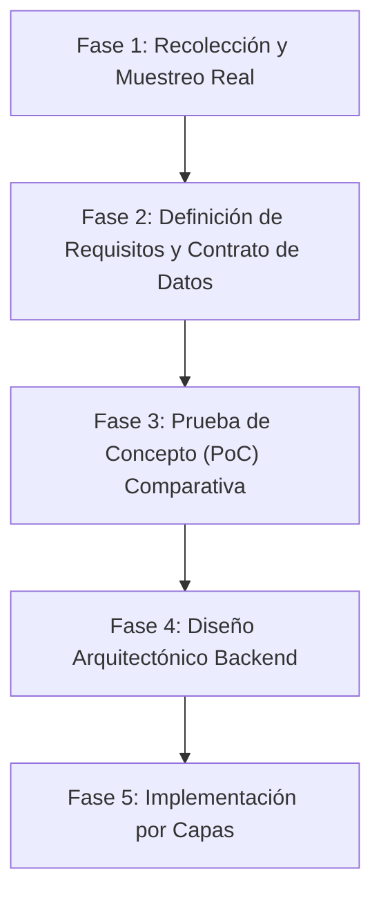

# Roadmap y Análisis: Módulo de IA y Digitalización (OCR)

Este documento complementa a [Decisiones Ejercicios y correcciones.md](./Decisiones%20Ejercicios%20y%20correcciones.md) y define la estrategia para la elección, diseño e implementación del submódulo de **Digitalización de Enunciados (OCR)** dentro de Abacontex.

---

## 1. Contexto y Filosofía de Diseño

El sistema Abacontex adopta una arquitectura donde:

- **El Backend conserva la lógica dura:** Las reglas contables, validaciones matemáticas (partida doble, balanceo, saldos) y estructuras pedagógicas están gobernadas por el backend y la base de datos.
- **La IA como motor auxiliar:** Se emplea exclusivamente para tareas no deterministas: interpretación de imágenes/documentos (OCR), generación acotada de enunciados con prompts paramétricos y síntesis pedagógica de errores en correcciones.
- **Intervención y control docente:** En la digitalización, el resultado del OCR nunca se envía directamente a los alumnos; siempre se presenta como una propuesta de texto editable que el docente revisa, ajusta y valida.

---

## 2. Alcance Funcional del OCR en Abacontex

A diferencia de un OCR genérico de texto corrido, los enunciados contables presentan particularidades críticas:

1. **Estructuras Contables Específicas:**
   - **Secuencias cronológicas numeradas:** Ejemplo: `1. 02/03 - Factura Original N.°...`
   - **Terminología y comprobantes:** Identificación precisa de abreviaturas (`F.O.`, `F.D.`, `R.O.`, `Pagaré`, `Cheque diferido`, etc.).
   - **Tablas de datos y balances:** En ejercicios de _Ajustes y Hoja de Trabajo_, el enunciado suele partir de un balance inicial de sumas y saldos. El motor debe respetar la estructura tabular y no desarmarla en líneas inconexas.
   - **Importes y cifras:** Máxima fidelidad con ceros, signos monetarios y separadores de miles y decimales (`$ 150.000,00`).

2. **Tolerancia al Insumo Real Escolar:**
   - Fotos de celular con sombras, perspectiva inclinada o iluminación deficiente.
   - Fotocopias escolares con degradación, dobladas o con marcas.
   - Documentos PDF (digitales de origen o escaneados).

3. **Flujo de Usuario (Docente):**
   - Sube imagen/PDF -> Se procesa con OCR -> Se previsualiza en el editor -> El docente corrige posibles errores -> Se guarda como borrador o se publica.

---

## 3. Formato de Salida y Contrato de Datos

### Formato de Presentación: Markdown Semántico

El contenido extraído se estructura en **Markdown** para permitir renderizado inmediato y edición sencilla:

- Encabezados (`### Empresa ficticia S.R.L.`)
- Énfasis en fechas y comprobantes (`**02/05 - Factura Original:** ...`)
- Listas numeradas para cada operación.
- Tablas en Markdown para balances de sumas y saldos.

### Estructura de Respuesta del Servicio (DTO conceptual)

```json
{
  "enunciadoTexto": "### Distribuidora Norte S.R.L.\n\n1. **02/05 - Factura Original N° 0001-00004523** por compra de mercaderías...\n2. **08/05 - Factura Duplicado N° 0001-00000102**..."
}
```

---

## 4. Comparativa de Alternativas Tecnológicas

| Criterio                            | Opción 1: OCR Clásico Local (Tesseract / PaddleOCR)           | Opción 2: Cloud Document AI (AWS Textract / Google Document AI) | Opción 3: LLM Multimodal de Visión (Gemini Flash / GPT-4o-mini)                                 |
| :---------------------------------- | :------------------------------------------------------------ | :-------------------------------------------------------------- | :---------------------------------------------------------------------------------------------- |
| **Procesamiento**                   | Motor local dentro del contenedor.                            | API Cloud especializada en OCR y tablas.                        | API de modelo multimodal con prompt de extracción guiado.                                       |
| **Comprensión de tablas contables** | Muy baja. Difícil de calibrar ante tablas rotas o fotocopias. | Muy alta en tablas formales; menor contexto pedagógico.         | **Excelente**. Entiende el contexto contable y reconstruye tablas en Markdown impecables.       |
| **Limpieza de ruido y formato**     | Nula. Solo devuelve caracteres planos.                        | Media. Extrae bloques y celdas.                                 | **Muy alta**. Corrige palabras cortadas, normaliza signos y devuelve Markdown directo.          |
| **Costos e Infraestructura**        | Sin costo por llamada, pero consume memoria/CPU del servidor. | Costo por página procesada (medio/alto a gran escala).          | **Extremadamente bajo** en modelos Flash orientados a visión; no consume recursos de CPU local. |
| **Integración técnica**             | Requiere dependencias nativas en Docker.                      | SDK Cloud específico.                                           | SDK oficial de IA / API REST estándar.                                                          |

> **Nota:** La Opción 3 (modelos multimodales rápidos como Gemini Flash) se perfila como la más costo-eficiente y precisa para documentos escolares con formato heterogéneo.

---

## 5. Hoja de Ruta (Roadmap) para la Definición e Implementación



### Fase 1: Recolección y Muestreo de Documentos Reales

- [x] Muestras aportadas y analizadas en `docs/muestras/`:
  - `1.jpeg`: Caso de Costos y Proceso Productivo (6.º Año S.A.).
  - `2.jpeg`: Caso de Ajustes y Hoja de Trabajo (5.º Año) con tabla de 21 cuentas y 6 columnas.
- [x] Alcance fijado en material impreso / mecanografiado.

### Fase 2: Definición de Requisitos y Contrato de Datos

- [x] Formato de salida validado: Markdown semántico GFM (tablas estándar, importes argentinos).
- [x] Límites definidos: JPG, PNG, WEBP, PDF hasta 10 MB (máx. 5 páginas).
- [x] DTOs y validadores Zod especificados y alineados con el prototipo de interfaz en [fase_2_requisitos_contrato_digitalizacion.md](./fase_2_requisitos_contrato_digitalizacion.md).

### Fase 3: Prueba de Concepto (PoC) Técnica

- [x] Procesamiento de muestras reales finalizado con éxito:
  - Fidelidad numérica 100% en tabla de 21 cuentas y balance de sumas y saldos de la Muestra 2.
  - Reconstrucción de jerarquías y tabla de insumos en la Muestra 1.
- [x] Decisión arquitectónica consolidada y documentada en el ADR formal: [001-motor-digitalizacion-ocr.md](../adrs/001-motor-digitalizacion-ocr.md).

### Fase 4: Diseño Arquitectónico en Backend

- [x] Pipeline y mapa de archivos diseñado siguiendo `GuiaDesarrolloBackend.md`.
- [x] Interfaz abstracta del proveedor de OCR definida (`IOcrProvider` en `src/integrations/ocr/`).
- [x] Pipeline de archivos en memoria con Multer y soporte PDF especificado.
- [x] Documento formal de arquitectura consolidado en [fase_4_diseno_arquitectonico_backend.md](./fase_4_diseno_arquitectonico_backend.md).

### Fase 5: Implementación Gradual y Validada

- [x] Implementación Backend completa:
  1. Contrato de datos y DTOs ([`src/dto/ejercicio/ejercicio.dto.ts`](../../backend/src/dto/ejercicio/ejercicio.dto.ts)).
  2. Servicio de extracción y clientes de integración con IA ([`src/integrations/ocr/`](../../backend/src/integrations/ocr/)).
  3. Controller y rutas del endpoint de digitalización (`POST /ejercicios/digitalizar`).
  4. Documentación OpenAPI / Swagger integrada ([`src/docs/paths/ejercicio.paths.ts`](../../backend/src/docs/paths/ejercicio.paths.ts)).
- [ ] Tests unitarios y de integración con mocks.
- [ ] Conectar con la vista de frontend para revisión y edición del enunciado digitalizado.
